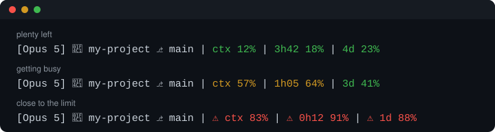

# claude-usage-statusline

[](https://github.com/ni-c/claude-usage-statusline/actions/workflows/ci.yml)
[](LICENSE)

A status line for [Claude Code](https://code.claude.com) that shows how much of your
rate limits you have used, and how long until they reset. It also shows the model,
the folder, the git branch and how full the context window is. It runs on Linux,
macOS and Windows.

<p align="center">
  
</p>

```text
[Opus 5] 📁 my-project ⎇ main | ctx 57% | 1h05 64% | 3d 41%
```

| Segment      | Meaning                                                                     |
| ------------ | --------------------------------------------------------------------------- |
| `[Opus 5]`   | The model of this session                                                   |
| `📁 my-project` | The folder Claude Code is working in                                     |
| `⎇ main`     | The git branch, or the short commit hash on a detached HEAD                 |
| `ctx 57%`    | How full the context window is                                              |
| `1h05 64%`   | The 5-hour limit: 64 % used, resets in 1 hour 5 minutes                     |
| `3d 41%`     | The weekly limit: 41 % used, resets within 3 days                           |

Each percentage turns yellow at 50 % and red with a `⚠` at 80 %.

The two rate limits only show up on a Claude Pro or Max subscription, and only after
the first answer of a session. Claude Code does not send them to people who use an API
key. Segments without data are left out, so the line never shows stale or made-up
numbers.

## Install

**Linux, macOS, WSL**

```sh
curl -fsSL https://github.com/ni-c/claude-usage-statusline/releases/latest/download/install.sh | bash
```

Needs [jq](https://jqlang.org/download/), both for the installer and for the status
line itself (`apt install jq`, `brew install jq`, `dnf install jq`, …).

**Windows (PowerShell)**

```powershell
irm https://github.com/ni-c/claude-usage-statusline/releases/latest/download/install.ps1 | iex
```

Needs nothing else: it runs on the Windows PowerShell that comes with every Windows,
and on PowerShell 7.

The installer comes with a release. It downloads the status line script from that same
release and checks it against a SHA-256 checksum written into the installer. The script
goes into `~/.claude/claude-usage-statusline/`. The installer then sets `statusLine` in
`~/.claude/settings.json` and leaves every other setting alone. A copy of your previous
settings is kept as `settings.json.before-claude-usage-statusline`. Claude Code picks up
the change within a few seconds.

If another status line is already configured, the installer stops and shows it to you.
To replace it:

```sh
curl -fsSL https://github.com/ni-c/claude-usage-statusline/releases/latest/download/install.sh | bash -s -- --force
```

```powershell
& ([scriptblock]::Create((irm https://github.com/ni-c/claude-usage-statusline/releases/latest/download/install.ps1))) -Force
```

`CLAUDE_CONFIG_DIR` is respected if you keep your Claude Code configuration somewhere else.

### Manual install

Download `statusline.sh` (or `statusline.ps1` on Windows) from the
[latest release](https://github.com/ni-c/claude-usage-statusline/releases/latest) and
point `statusLine` at it in `~/.claude/settings.json`:

```json
{
  "statusLine": {
    "type": "command",
    "command": "bash ~/.claude/claude-usage-statusline/statusline.sh",
    "refreshInterval": 30
  }
}
```

On Windows:

```json
{
  "statusLine": {
    "type": "command",
    "command": "powershell -NoProfile -ExecutionPolicy Bypass -File 'C:/Users/you/.claude/claude-usage-statusline/statusline.ps1'",
    "refreshInterval": 30
  }
}
```

Use forward slashes and single quotes on Windows. Claude Code runs the command through
Git Bash if it is installed and through PowerShell if it is not, and that way the same
line works in both. `refreshInterval` makes the countdown keep moving while Claude Code
is idle.

## Configuration

Set these in the `env` block of `settings.json`, so they reach the status line on every
platform:

```json
{
  "env": {
    "CLAUDE_STATUSLINE_SEGMENTS": "model,dir,git,5h,7d",
    "CLAUDE_STATUSLINE_WARN": "90"
  }
}
```

| Variable                     | Default                    | Effect                                                                  |
| ---------------------------- | -------------------------- | ----------------------------------------------------------------------- |
| `CLAUDE_STATUSLINE_SEGMENTS` | `model,dir,git,ctx,5h,7d`  | Which segments to show, in this order. Unknown names are ignored.       |
| `CLAUDE_STATUSLINE_WARN`     | `80`                       | From this percentage on: red with `⚠`.                                  |
| `CLAUDE_STATUSLINE_NOTICE`   | `50`                       | From this percentage on: yellow.                                        |
| `CLAUDE_STATUSLINE_NO_EMOJI` | unset                      | `1` replaces `📁`, `⎇` and `⚠` with plain text, for fonts without them. |
| `NO_COLOR`                   | unset                      | Any value turns colours off ([no-color.org](https://no-color.org)).     |

## Uninstall

```sh
curl -fsSL https://github.com/ni-c/claude-usage-statusline/releases/latest/download/install.sh | bash -s -- --uninstall
```

```powershell
& ([scriptblock]::Create((irm https://github.com/ni-c/claude-usage-statusline/releases/latest/download/install.ps1))) -Uninstall
```

This removes the `statusLine` entry, but only if it points at this status line, and
deletes `~/.claude/claude-usage-statusline/`.

## Troubleshooting

- **The line says `jq is required`.** Install jq, see above. On Windows, use
  `install.ps1`, which does not need jq.
- **Boxes instead of icons.** Your terminal font has no `📁`, `⎇` or `⚠`. Set
  `CLAUDE_STATUSLINE_NO_EMOJI=1`.
- **No `5h`/`7d` segments.** Rate limits are only reported for Pro and Max
  subscriptions, and only after the first answer of a session.
- **No branch.** Git is not installed, or the folder is not inside a git repository.

## How it works

Claude Code pipes a JSON document into the status line command
([documentation](https://code.claude.com/docs/en/statusline)). This status line reads
`model.display_name`, `workspace.current_dir`, `context_window.used_percentage` and
`rate_limits.five_hour` / `rate_limits.seven_day` from it and prints one line. It reads
no files and writes none, and it sends nothing anywhere. The only thing it runs is
`git`, to read the branch name.

There are two implementations that print exactly the same bytes: `statusline.sh`
(bash 3.2 or newer, with jq) and `statusline.ps1` (Windows PowerShell 5.1 or
PowerShell 7). Both are tested against the same list of cases in
[`tests/cases.tsv`](tests/cases.tsv).

## Development

```sh
bats tests/                                   # statusline.sh and install.sh
pwsh -File tests/Invoke-Tests.ps1             # statusline.ps1 and install.ps1
shellcheck statusline.sh install.sh scripts/*.sh
scripts/render-preview.sh                     # after changing the output format
```

CI runs all of this on Linux, on macOS with its own `/bin/bash` 3.2, and on Windows with
both Windows PowerShell 5.1 and PowerShell 7.

## License

[MIT](LICENSE)
